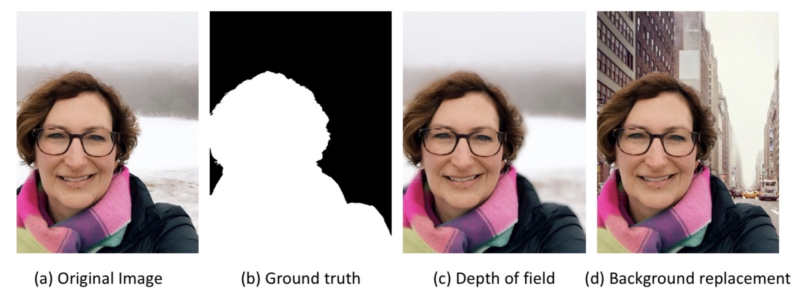
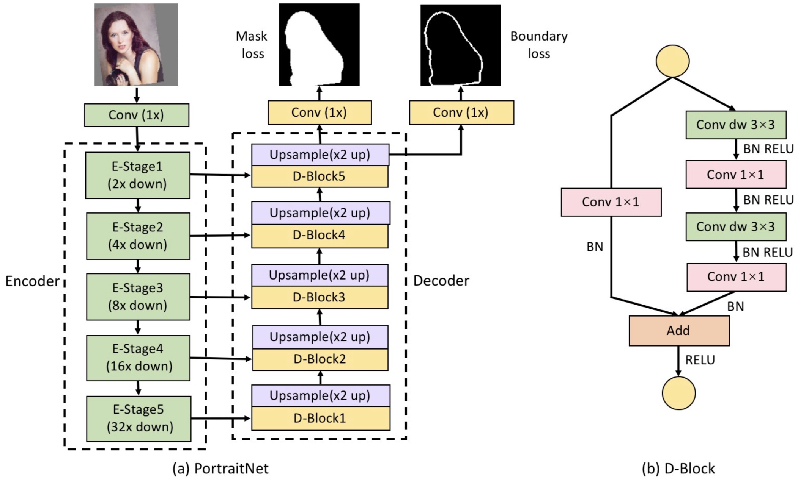

# PortraitNet

Code for the paper ["PortraitNet: Real-time portrait segmentation network for mobile device".](https://www.sciencedirect.com/science/article/pii/S0097849319300305) @ CAD&Graphics 2019

---
## Introduction

We propose a real-time portrait segmentation model, called PortraitNet, that can run effectively and efficiently on mobile device. PortraitNet is based on a lightweight U-shape architecture with two auxiliary losses at the training stage, while no additional cost is required at the testing stage for portrait inference. 

<div align="center">

<p> Portrait segmentation applications on mobile device.</p>
</div>

---
## Experimental setup

### Requirements
- python 2.7
- PyTorch 0.3.0.post4
- Jupyter Notebook
- pip install easydict matplotlib tqdm opencv-python scipy pyyaml numpy


### Download datasets
- [EG1800](https://pan.baidu.com/s/1myEBdEmGz6ufniU3i1e6Uw) Since several image URL links are invalid in the [original EG1800 dataset](http://xiaoyongshen.me/webpage_portrait/index.html), we finally use 1447 images for training and 289 images for validation. 

- [Supervise-Portrait](https://pan.baidu.com/s/1uBtCsLj156e_iy3DtkvjQQ) Supervise-Portrait is a portrait segmentation dataset collected from the public human segmentation dataset [Supervise.ly](https://supervise.ly/) using the same data process as EG1800.

---
## Training
### Network Architecture

<div align="center">

<p> Overview of PortraitNet.</p>
</div>

### Training Steps
- Download the datasets (EG1800 or Supervise-Portriat). If you want to training at your own dataset, you need to modify data/datasets.py and data/datasets_portraitseg.py.
- Prepare training/testing files, like data/select_data/eg1800_train.txt and data/select_data/eg1800_test.txt.
- Select and modify the parameters in the folder of config.
- Start the training with single gpu:
```
cd myTrain
python2.7 train.py
```

---
## Testing
In the folder of myTest:
- you can use `EvalModel.ipynb` to test on testing datasets.
- you can use `VideoTest.ipynb` to test on a single image or video.

---
## Visualization
Using tensorboard to visualize the training process:
```
cd path_to_save_model
tensorboard --logdir='./log'
```

---
## Download models
from Dropbox:
- [mobilenetv2_eg1800_with_two_auxiliary_losses](https://www.dropbox.com/s/nyanai43cnynqlx/mobilenetv2_eg1800_with_two_auxiliary_losses.tar?dl=0)(Training on EG1800 with two auxiliary losses)
- [mobilenetv2_supervise_portrait_with_two_auxiliary_losses](https://www.dropbox.com/s/pyocc3en6t63itp/mobilenetv2_supervise_portrait_with_two_auxiliary_losses.tar?dl=0)(Training on Supervise-Portrait with two auxiliary losses)
- [mobilenetv2_total_with_prior_channel](https://www.dropbox.com/s/37zz9kkyki1wv8e/mobilenetv2_total_with_prior_channel.tar?dl=0)(Training on Human with prior channel)


from Baidu Cloud:
- [mobilenetv2_eg1800_with_two_auxiliary_losses](https://pan.baidu.com/s/1oEMwxQUvpONA913I95Od-w)(Training on EG1800 with two auxiliary losses)
- [mobilenetv2_supervise_portrait_with_two_auxiliary_losses](https://pan.baidu.com/s/1nCJp7RS2rv7SxNz8_Lfmcg)(Training on Supervise-Portrait with two auxiliary losses)
- [mobilenetv2_total_with_prior_channel](https://pan.baidu.com/s/1sEG87ezvIZ4-iTa4W_hfYA)(Training on Human with prior channel)
